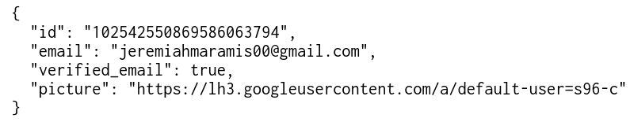

# Refactory Golang Engineer Test

## Database Diagram

## Database Schema

Only one schema that is used on this database (refactory-auth)

## Application Flow

1. User can log in by clicking the login link
   
2. The web page will be redirect to Google Authentication page
   
3. The web page will be redirect to the particular user information
   
4. If user want to get all the email and id from all users login go to **http://localhost:3000/users**
   
